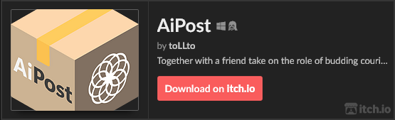
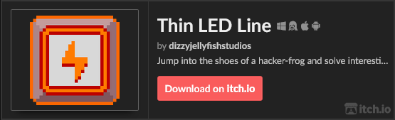
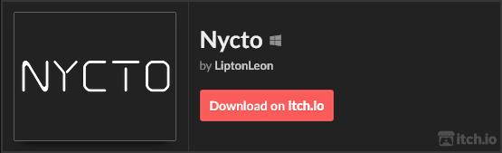

# About me #
### Hello! 😄

Bachelor of Computer Science at Technical University of Lodz. Fan of racing games and DnD. I've started my gamdev journey 4 years ago. My first (and favourite) engine is Godot, but currently I'm working on two Unity projects. I've also got some experience with Unreal Engine.

# Game engine project

During CS course at TUL we were required to create a video game using custom made engine. After 4 months of work in a team of 7 people we've managed to make **AiPost**. We've showcased out project at Zespołowe Tworzenie Gier Komputerowych 2024 contest in Lodz and won 1st place. Full source code is available [here](https://github.com/Memory-Leak-Games/Project-InPostors)!

# Game projects #

### [And many more!](https://liptonleon.itch.io/) ###
 

 
 

  

 
